# 🛡️ MacAegis

<p align="center">
  
</p>

<p align="center">
  <strong>一款纯原生 Swift 编写的 Mac 隐私文件隐匿与轻量系统维护工具</strong>
</p>

<p align="center">
  
  
  
  
  
</p>

<p align="center">
  <a href="#-功能概览与界面预览">功能预览</a> •
  <a href="#-安装使用与常见问题">安装指南</a> •
  <a href="#-下载体验">下载地址</a> •
  <a href="README_EN.md">English Version</a>
</p>

---

## 📖 软件介绍

平时使用 Mac 时，总有些私人工作文件或重要文件夹不想被别人随手翻看。**MacAegis** 为此而生，主打**隐私文件夹与文件的一键隐匿**，做到**秒藏秒解**：

* **秒级隐形**：将文件夹或单体文件拖入，立即在访达中隐形，并且无法通过空格键快速预览；
* **极速解锁**：需要使用时，通过 Touch ID 指纹或主密码瞬间恢复查看；
* **轻量维护**：同时整合了常用的系统缓存清理、应用深度卸载残留定位，以及常驻状态栏硬件与网速监控；
* **干净克制**：纯本地离线运行，不收集任何用户数据，退出即完全释放。


---

## 📸 功能概览与界面预览 (Feature Showcase)

### 1. 核心主控台 (Dashboard)
直观展示系统整体健康度，提供一键智能清理入口与深度扫描反馈，支持外接磁盘容量识别。
<p align="center">
  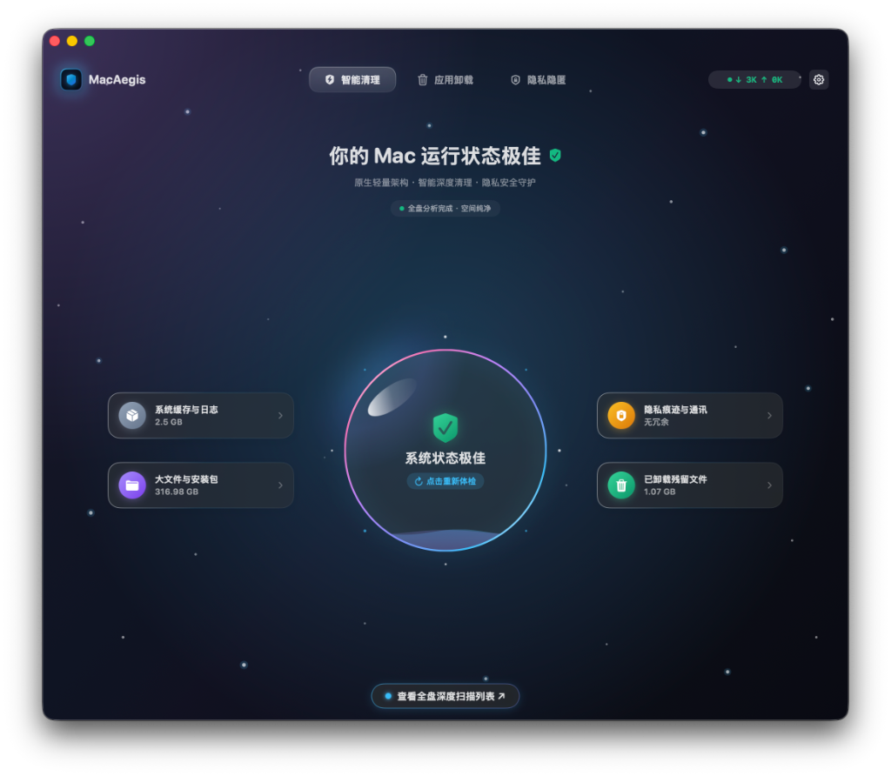
</p>

### 2. 隐私解锁机制 (Vault Unlock)
强制接入 macOS 原生 Touch ID 与系统密码验证，强力阻断未经授权的访问请求。
<p align="center">
  
</p>

### 3. 隐私隐匿引擎 (Vault Engine)
采用底层文件路径重定向与权限抽离技术，支持拖拽快速导入核心数据，隐匿过程不占用额外存储空间。
<p align="center">
  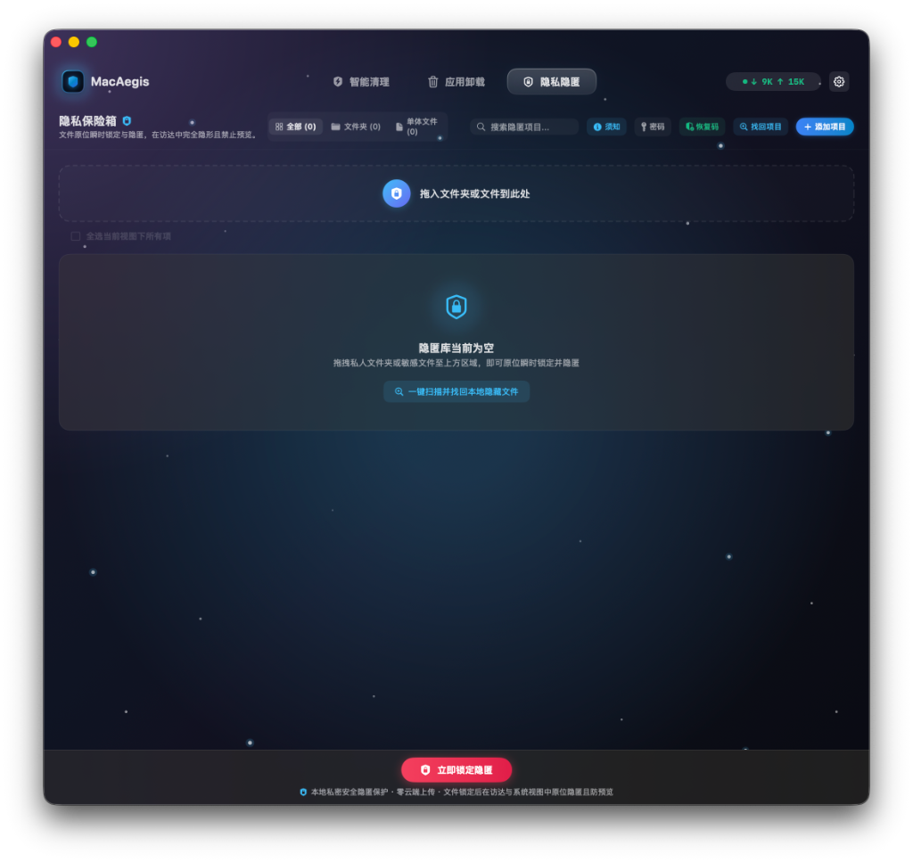
</p>

### 4. 隐匿资产管理 (Concealed Assets)
对已保护的文件及文件夹进行结构化排布，实时反馈目标路径的锁定状态。
<p align="center">
  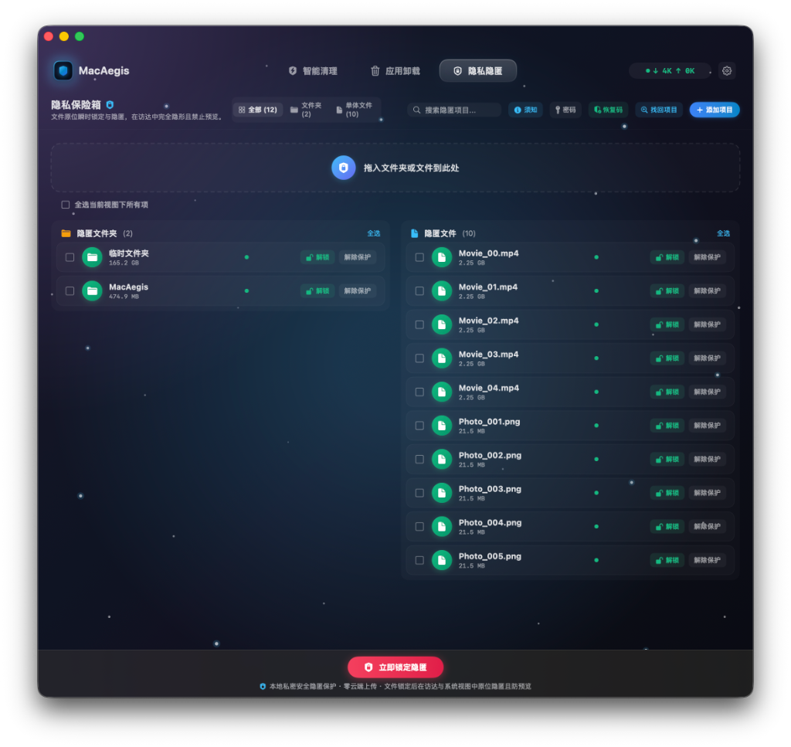
</p>

### 5. 批量状态控制 (Batch Operations)
支持多选与全局全选，一键完成海量文件的解除保护或重新锁定，操作耗时均在毫秒级。
<p align="center">
  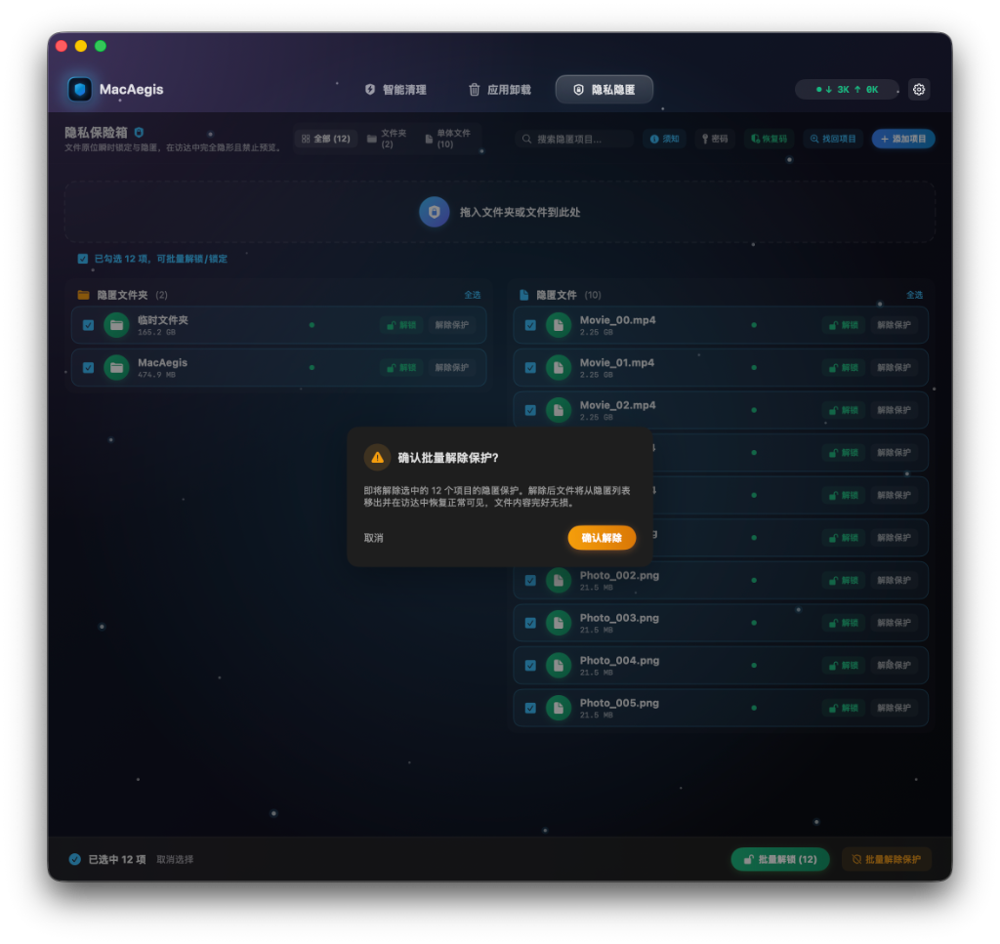
</p>

### 6. 灾备与安全须知 (User Notice & Recovery)
内置防呆设计与恢复码机制，确保用户在意外丢失权限或忘记密码时依然能够安全取回数据。
<p align="center">
  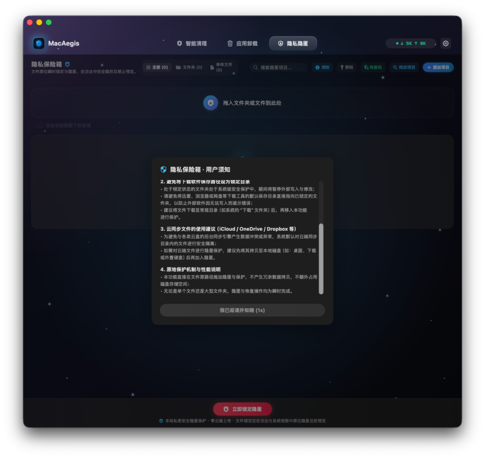
</p>
<p align="center">
  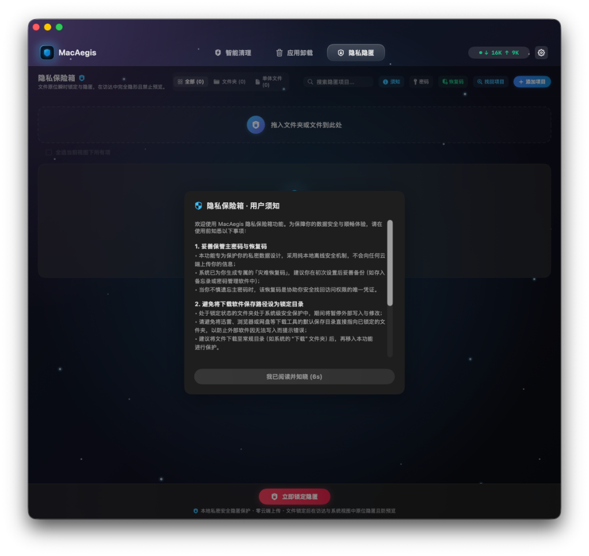
</p>

### 7. 深度应用卸载 (Deep Uninstaller)
穿透系统沙盒，精准定位并枚举系统中已安装的应用及其物理占用体积。
<p align="center">
  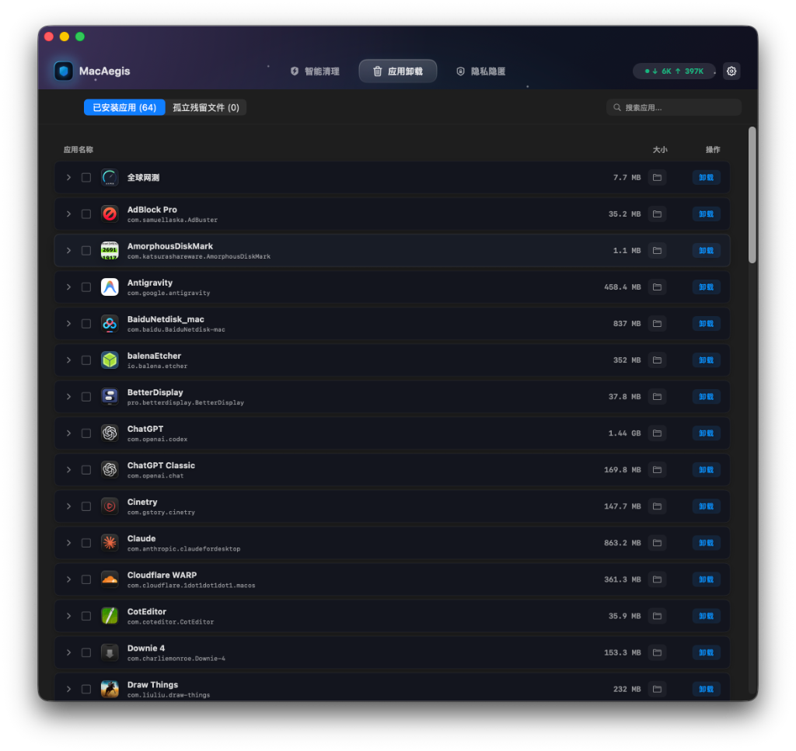
</p>

### 8. 孤立残留粉碎 (Leftover Crushing)
自动追踪已卸载程序的底层残留文件（含群组容器与偏好设置），支持通过特权提升执行无死角清理。
<p align="center">
  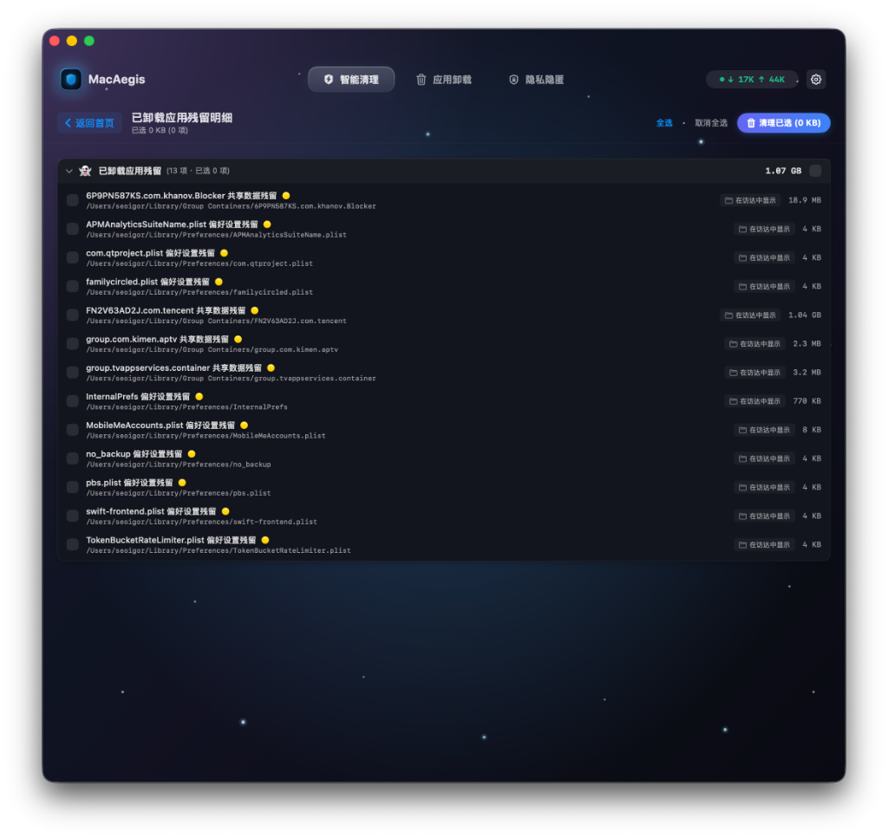
</p>

### 9. 偏好设置 (Preferences)
支持跟随系统级别的深浅色模式自动切换，提供中英双语无缝热重载及自定义硬件监测偏好。
<p align="center">
  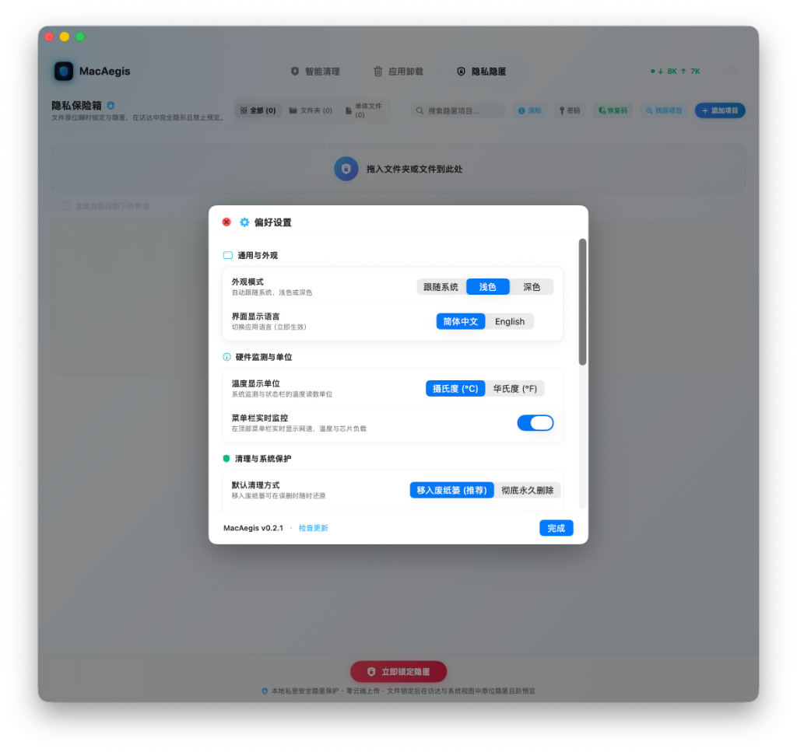
</p>
<p align="center">
  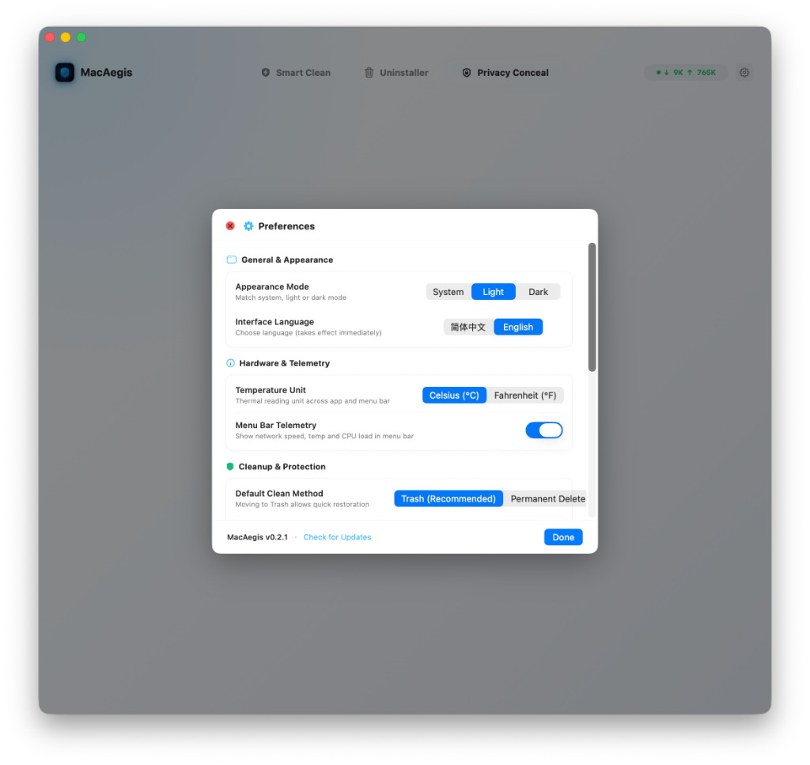
</p>

### 10. 状态栏硬件监控 (Menubar Telemetry)
采用低耗内核级轮询技术，实时呈现网络吞吐率、芯片核心温度、风扇转速及多态内存占用。
<p align="center">
  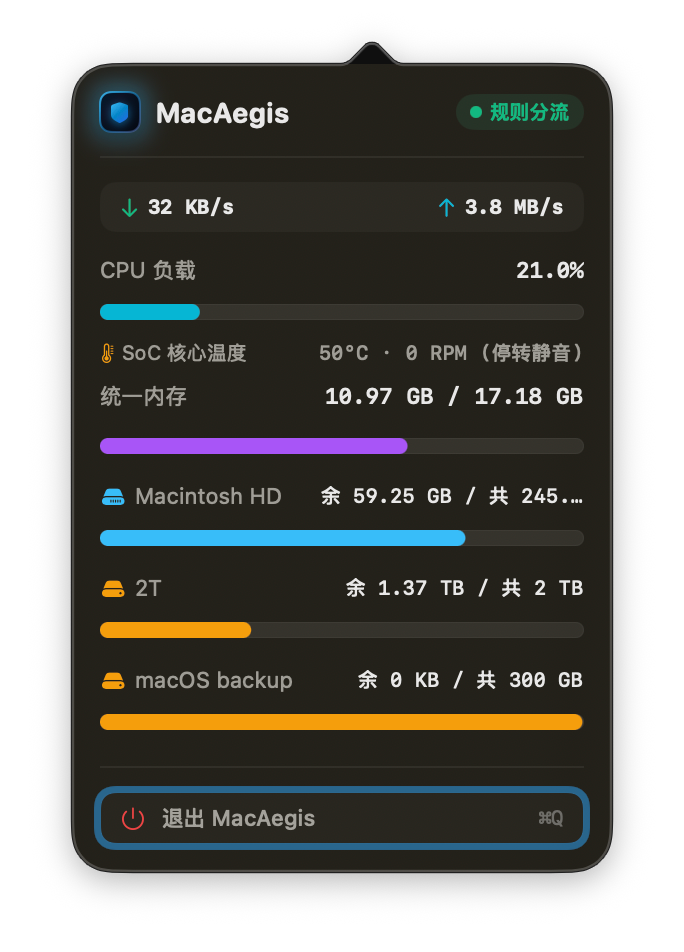
</p>

---

## 🚀 安装使用与常见问题

### 1. 标准安装步骤
#### 选项 A：通过 Homebrew 一键安装（推荐 · 极客首选）
```bash
brew install meowvia/tap/macaegis
```

#### 选项 B：手动下载安装（含一键覆盖更新机制）
1. 在 [Releases 发布页面](https://github.com/meowvia/MacAegis/releases) 下载最新的 `MacAegis-vX.Y.Z.zip` 或 `.dmg` 格式安装包；
2. **全新安装**：双击解压后，将 **MacAegis.app** 拖入系统的 **Applications**（应用程序）文件夹中；
3. **旧版无缝更新**：如果你下载的是 `.dmg` 安装镜像，可直接双击运行内置的 `Update Assistant (更新助手).command`，程序将自动终止并清理旧版残留进程，安全完成深度替换；
4. 在启动台或访达「应用程序」中直接打开 MacAegis 即可开始使用。

---

### 2. 遇到“应用已损坏 / 无法验证开发者”如何解决？

由于个人独立开发且未购买苹果每年昂贵的商业开发者证书，首次打开时 macOS Gatekeeper 安全机制可能会弹出提示：
> *“「MacAegis」已损坏，无法打开。你应该将它移到废纸篓。”* 或 *“无法打开，因为无法验证开发者”*

**解决办法（只需执行一次）：**
1. 打开系统自带的 **终端（Terminal）** 应用程序（可在聚焦搜索 Spotlight 中输入 Terminal 打开）；
2. 复制并粘贴以下命令后按回车执行（如提示输入密码，直接输入开机密码即可）：
```bash
sudo xattr -rd com.apple.quarantine /Applications/MacAegis.app
```
3. 重新打开 MacAegis 即可顺畅运行。

---

### 3. 完全磁盘访问权限（FDA）说明
为了能够正常扫描系统缓存残留并在访达中定位深层文件，首次使用清理或卸载功能时，建议根据软件提示开启系统的 **完全磁盘访问权限 (Full Disk Access)**：
* 打开 **系统设置** → **隐私与安全性** → **完全磁盘访问权限**，找到 **MacAegis** 并勾选开启。

---

## 📦 下载体验

* **GitHub 最新版本**：[MacAegis Releases](https://github.com/meowvia/MacAegis/releases)
* **系统要求**：macOS 14.0 (Sonoma) 或更高版本，兼容 Apple Silicon (M1/M2/M3/M4) 及 Intel 机型。

---

## 📄 许可说明

MacAegis 是一款免费独立软件。所有功能均在本地运行，欢迎下载体验并提交反馈与建议！
