# 🛡️ MacAegis

<p align="center">
  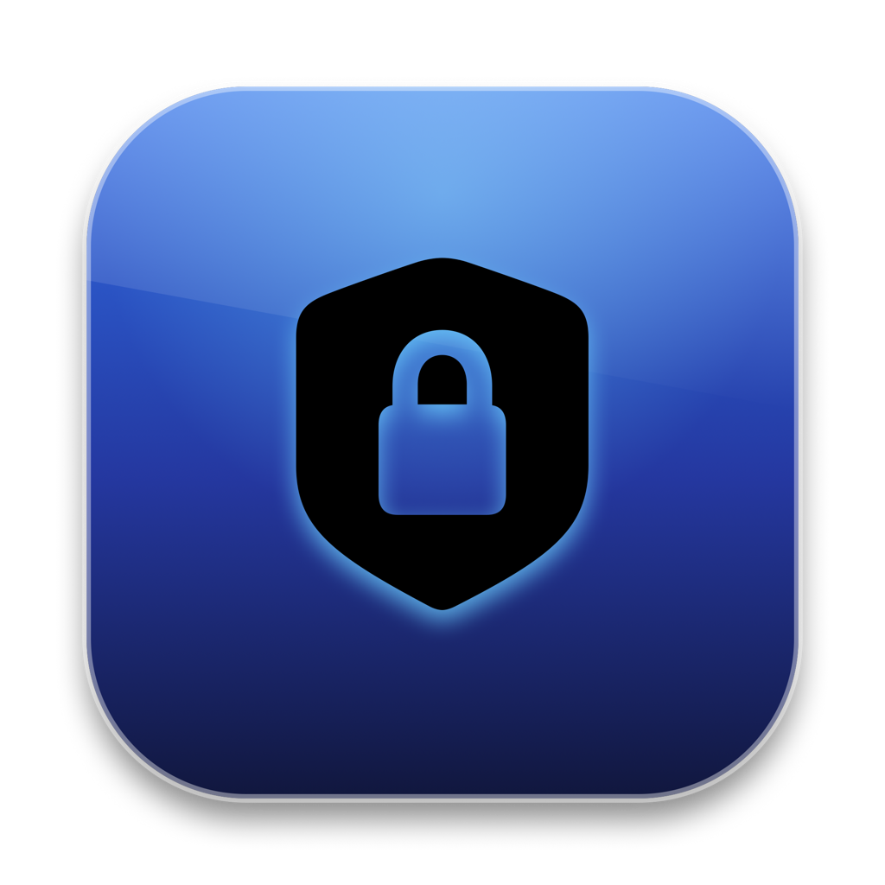
</p>

<p align="center">
  <strong>一款纯原生 Swift 编写的 Mac 隐私文件隐匿与轻量系统维护工具</strong>
</p>

<p align="center">
  
  
  
  
  
</p>

<p align="center">
  <a href="#-功能概览与界面预览">功能预览</a> •
  <a href="#-安装使用与常见问题">安装指南</a> •
  <a href="#-下载体验">下载地址</a> •
  <a href="README_EN.md">English Version</a>
</p>

---

## 📖 软件介绍

平时使用 Mac 时，总有些私人工作文件或重要文件夹不想被别人随手翻看。**MacAegis** 为此而生，主打**隐私文件夹与文件的一键隐匿**，做到**秒藏秒解**：

* **秒级隐形**：将文件夹或单体文件拖入，立即在访达中隐形，并且无法通过空格键快速预览；
* **极速解锁**：需要使用时，通过 Touch ID 指纹或主密码瞬间恢复查看；
* **轻量维护**：同时整合了常用的系统缓存清理、应用深度卸载残留定位，以及常驻状态栏硬件与网速监控；
* **干净克制**：纯本地离线运行，不收集任何用户数据，退出即完全释放。


---

## 📸 功能概览与界面预览

### 一、 隐私隐匿与防翻看

支持文件夹与文件的快速隐匿与锁定。首次使用时设置独立主密码，并提供本地专属灾难恢复凭证。

#### 1. 初始化设置主密码
<p align="center">
  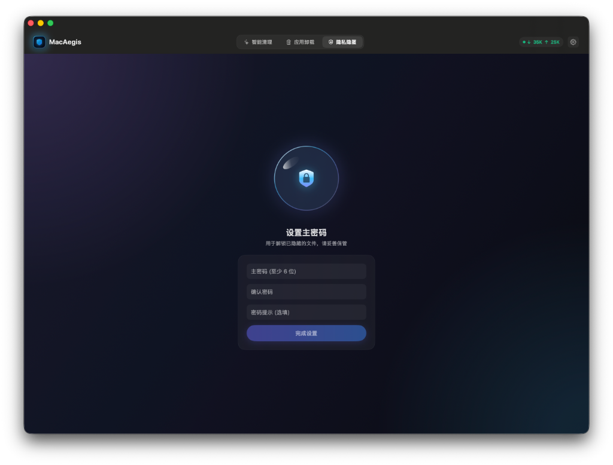
</p>

#### 2. 内置用户须知与使用指引
首次进入主动展示使用须知，包含恢复码保管与外部下载协同说明。
<p align="center">
  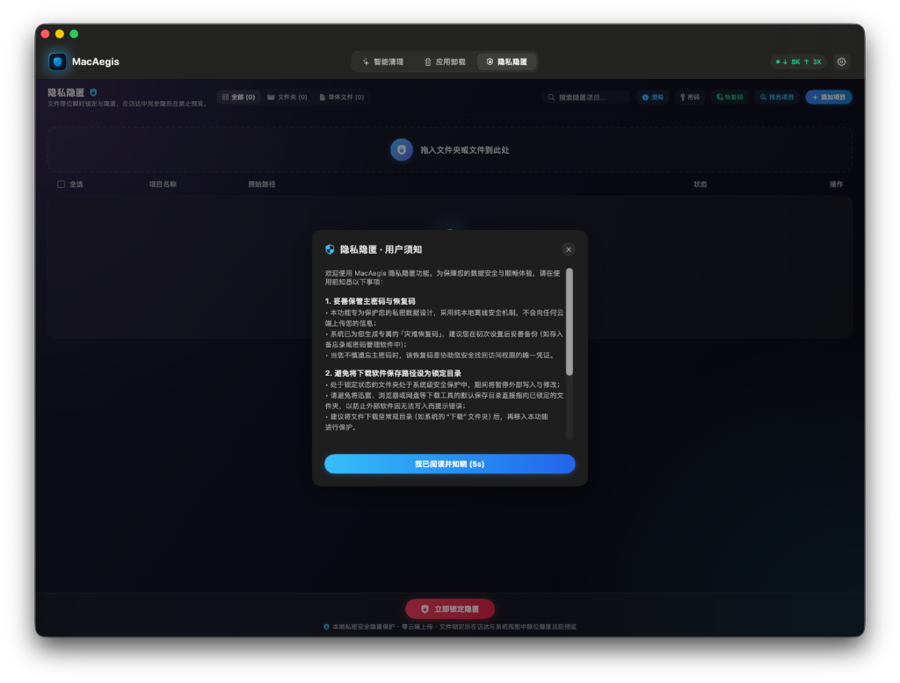
</p>
<p align="center">
  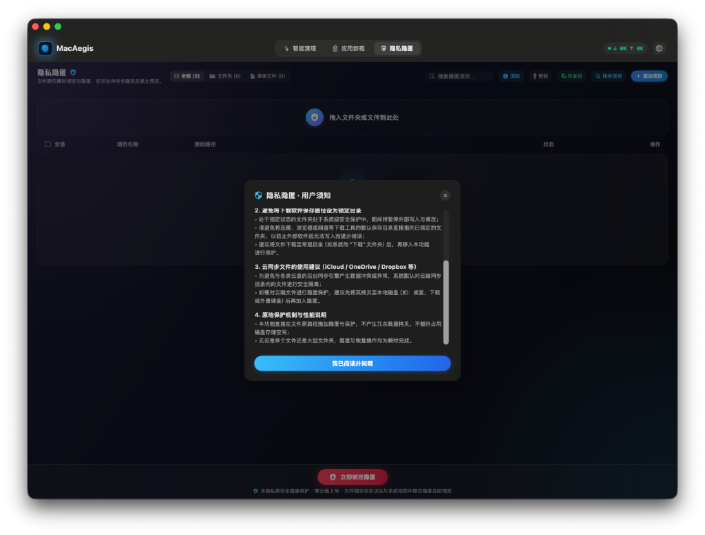
</p>

#### 3. 隐匿列表与分类管理
清晰展示已隐匿的文件夹与单体文件，支持按分类独立筛选，拖拽加入即刻弹出统计反馈。
<p align="center">
  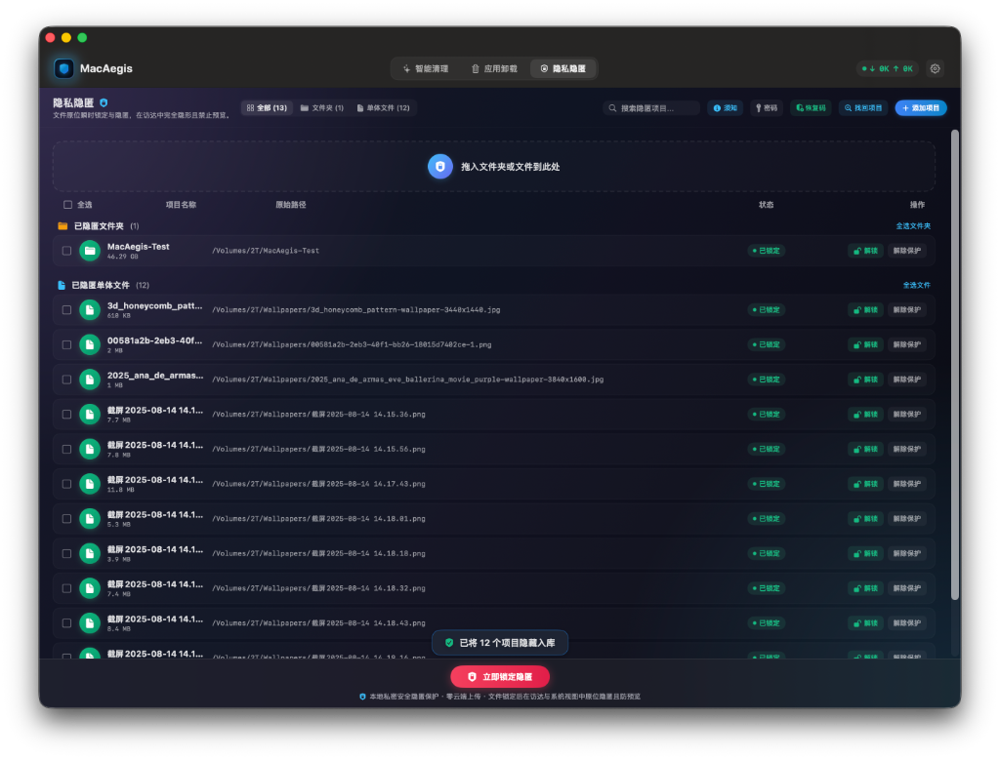
</p>

#### 4. 批量多选与解除保护二次确认
支持全局全选与多选，一键批量执行锁定、解锁或移出保护，配备二次确认防误触。
<p align="center">
  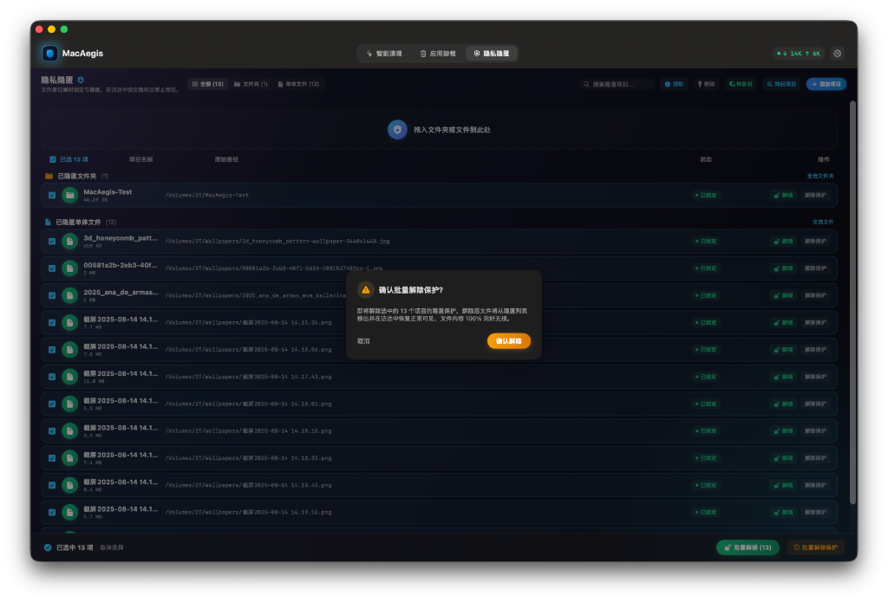
</p>

---

### 二、 智能清理控制台

根据系统当前的冗余状态进行智能健康评估，支持一键快速清理与全盘深度扫描，支持外接移动硬盘识别。

<p align="center">
  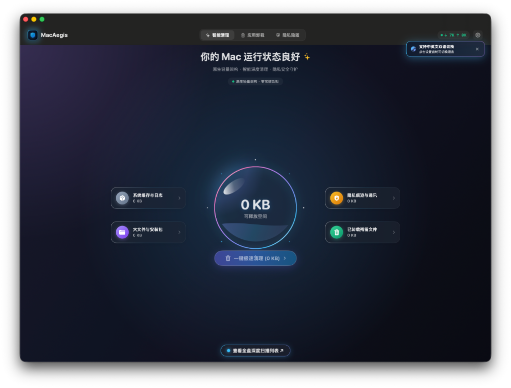
</p>

---

### 三、 偏好设置与权限管理

支持跟随系统外观（浅色/深色）、中英双语即时切换、温度单位选择、废纸篓监听配置以及完全磁盘访问权限（FDA）引导。

<p align="center">
  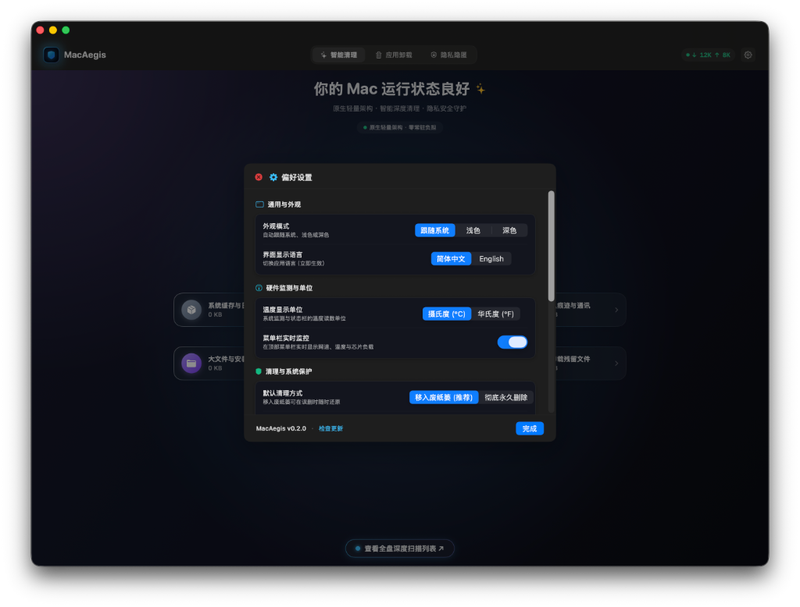
</p>
<p align="center">
  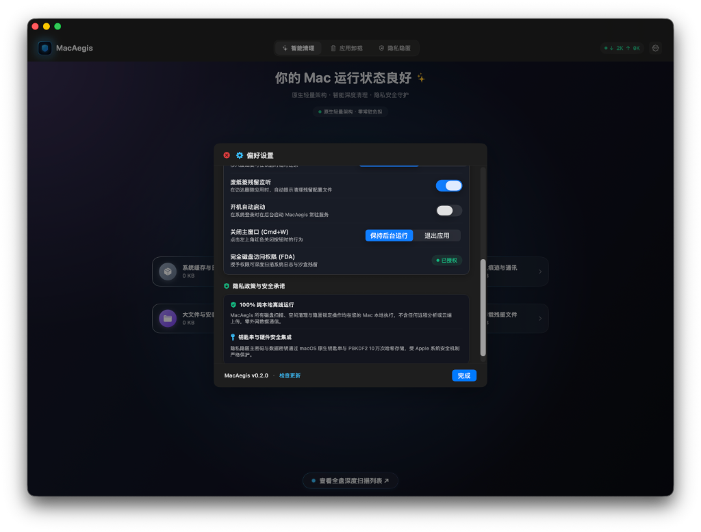
</p>

---

### 四、 应用深度卸载与残留定位

拖拽或选择 App 进行深度卸载分析，手风琴式平滑展开主程序包、沙盒容器、应用支持、缓存与偏好设置等详细文件，支持一键在访达中定位子项。

<p align="center">
  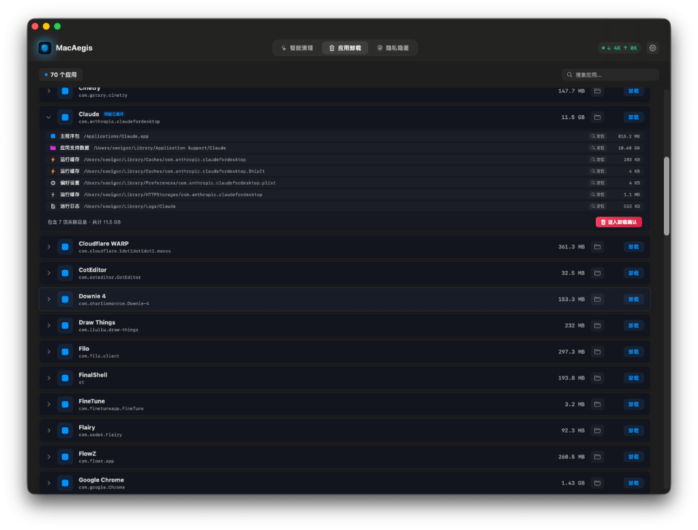
</p>

---

### 五、 状态栏实时监控

常驻菜单栏悬浮卡片，实时呈现上下行网速、SoC 芯片温度、风扇转速、统一内存占用及多磁盘空间状态。

<p align="center">
  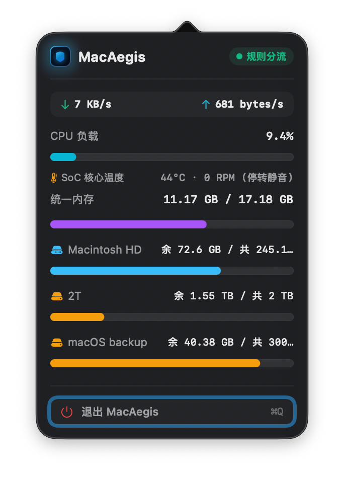
</p>

---

## 🚀 安装使用与常见问题

### 1. 标准安装步骤
#### 选项 A：通过 Homebrew 一键安装（推荐 · 极客首选）
```bash
brew install meowvia/tap/macaegis
```

#### 选项 B：手动下载 Zip 压缩包安装
1. 在 [Releases 发布页面](https://github.com/meowvia/MacAegis/releases) 下载最新的 `MacAegis-vX.Y.Z.zip` 压缩包；
2. 双击解压后，将 **MacAegis.app** 拖入系统的 **Applications**（应用程序）文件夹中；
3. 在启动台或访达「应用程序」中直接打开 MacAegis 即可开始使用。

---

### 2. 遇到“应用已损坏 / 无法验证开发者”如何解决？

由于个人独立开发且未购买苹果每年昂贵的商业开发者证书，首次打开时 macOS Gatekeeper 安全机制可能会弹出提示：
> *“「MacAegis」已损坏，无法打开。你应该将它移到废纸篓。”* 或 *“无法打开，因为无法验证开发者”*

**解决办法（只需执行一次）：**
1. 打开系统自带的 **终端（Terminal）** 应用程序（可在聚焦搜索 Spotlight 中输入 Terminal 打开）；
2. 复制并粘贴以下命令后按回车执行（如提示输入密码，直接输入开机密码即可）：
```bash
sudo xattr -rd com.apple.quarantine /Applications/MacAegis.app
```
3. 重新打开 MacAegis 即可顺畅运行。

---

### 3. 完全磁盘访问权限（FDA）说明
为了能够正常扫描系统缓存残留并在访达中定位深层文件，首次使用清理或卸载功能时，建议根据软件提示开启系统的 **完全磁盘访问权限 (Full Disk Access)**：
* 打开 **系统设置** → **隐私与安全性** → **完全磁盘访问权限**，找到 **MacAegis** 并勾选开启。

---

## 📦 下载体验

* **GitHub 最新版本**：[MacAegis Releases](https://github.com/meowvia/MacAegis/releases)
* **系统要求**：macOS 14.0 (Sonoma) 或更高版本，兼容 Apple Silicon (M1/M2/M3/M4) 及 Intel 机型。

---

## 📄 许可说明

MacAegis 是一款免费独立软件。所有功能均在本地运行，欢迎下载体验并提交反馈与建议！
