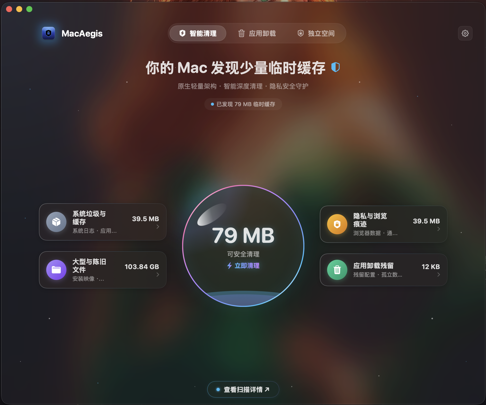
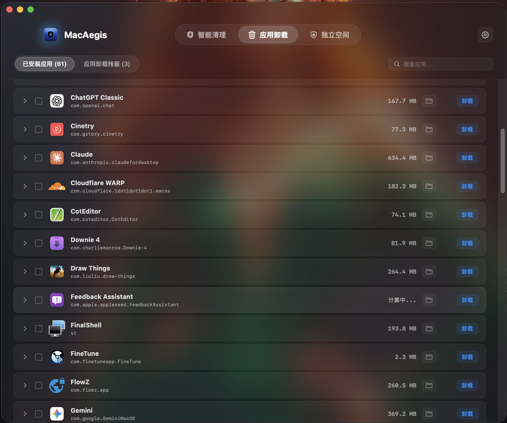
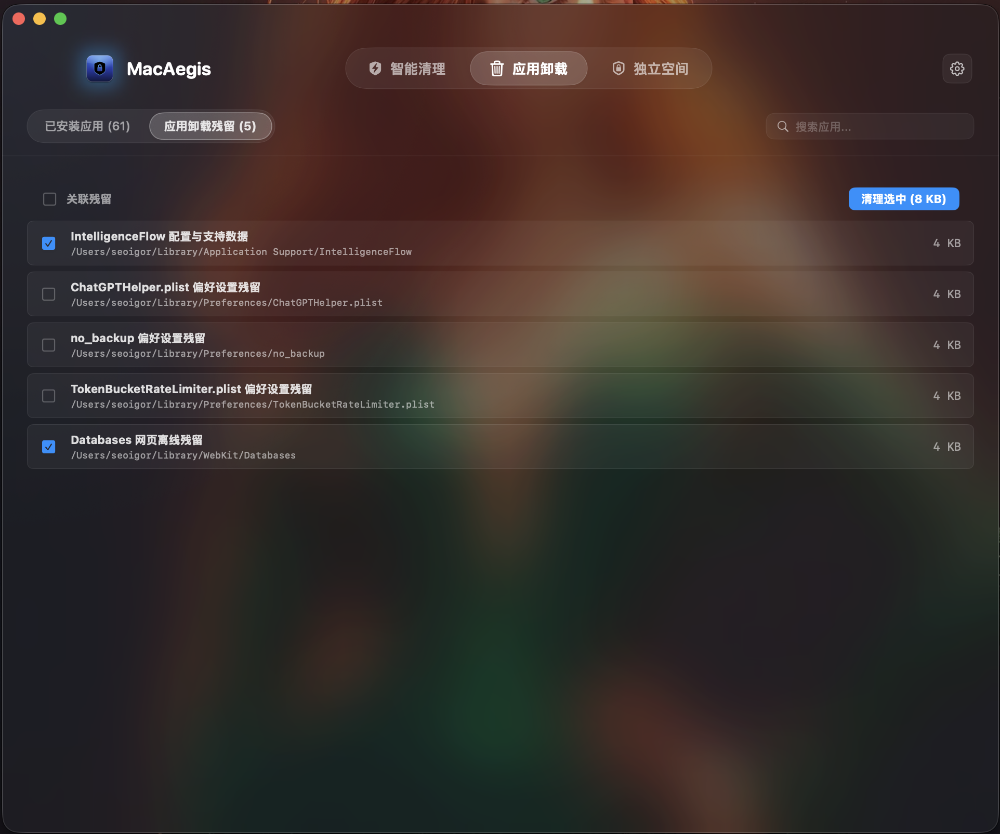
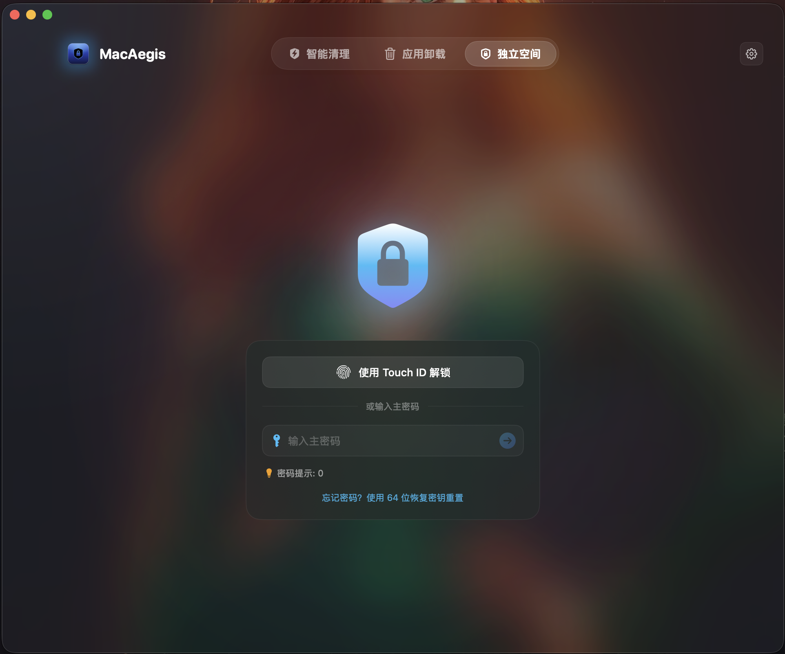
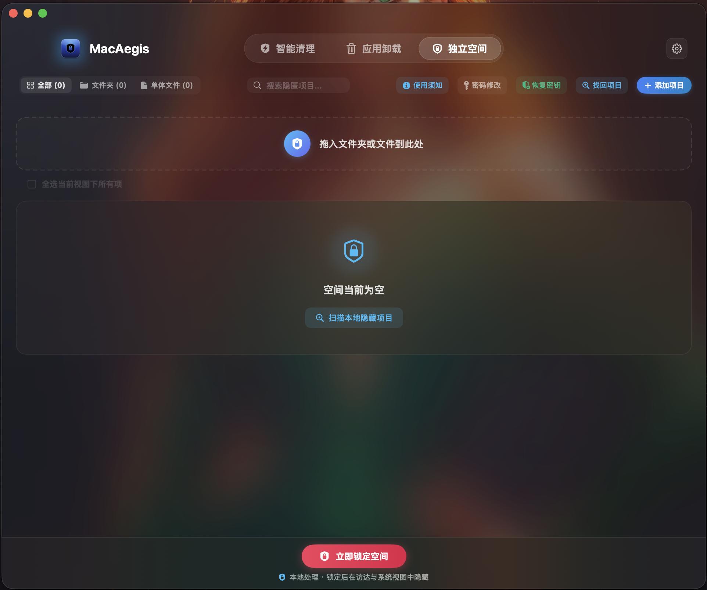
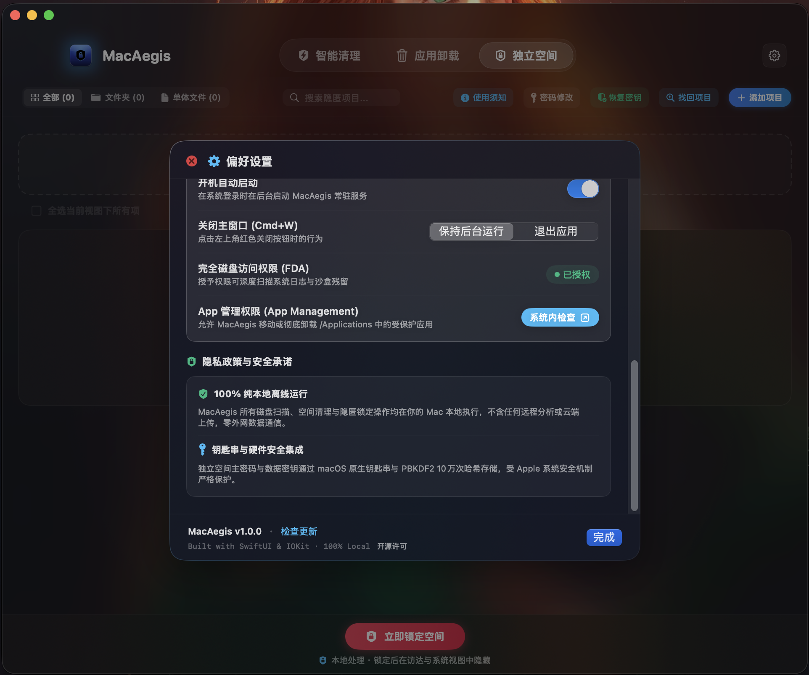
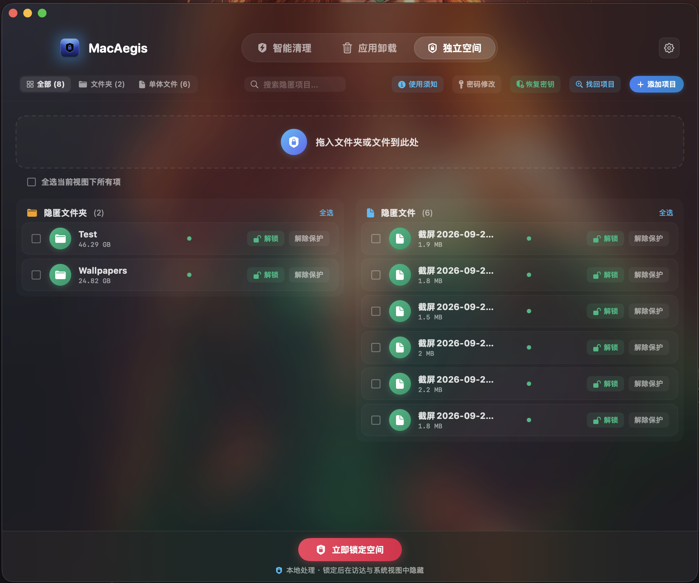
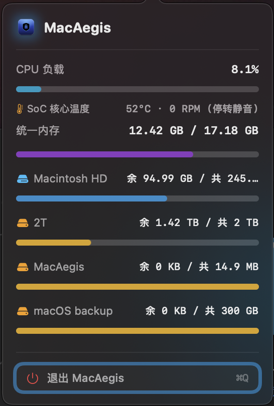

# 🛡️ MacAegis

<p align="center">
  
</p>

<p align="center">
  <strong>一款基于纯原生 Swift 构建的 Mac 独立空间与轻量系统维护工具</strong>
</p>

<p align="center">
  
  
  
  
  
</p>

<p align="center">
  <a href="#-功能概览与界面预览">功能预览</a> •
  <a href="#-安装与使用指南">安装指南</a> •
  <a href="#-下载体验">下载地址</a> •
  <a href="README_EN.md">English Version</a>
</p>

---

## 📖 软件介绍

**MacAegis** 是一款专为 macOS 设计的现代化桌面实用工具，专注于**文件夹与文件的极速隐匿保护、应用深度卸载残留扫描与轻量系统维护**。

在日常使用 Mac 时，个人私密文件、工作敏感资料常有防窥与归档需求，同时系统也经常积累开发与应用残留。MacAegis 为此提供了高效、纯粹且优雅的原生解决方案：

* **全面拥抱现代流动玻璃（Liquid Glass）设计**：深度适配 macOS 原生视觉哲学，采用一体化贯通式顶栏、半透明磨砂质感与平滑交互动效，与最新 macOS 桌面环境自然契合。
* **纯 Swift 原生架构**：全栈使用 Swift 6 编写，针对 Apple Silicon 芯片与 Intel 架构全面调优。安装镜像仅约 **1.7 MB**，告别庞大的跨平台运行库，启动迅速，后台闲置时资源开销趋近于零。
* **不限大小的极速隐匿与解锁**：独创“独立空间”管理模式，无论是日常小型文档，还是数十甚至上百 GB 的庞大工程目录、音视频媒体库，拖入即可原位快速隐匿，锁定后在访达与全局搜索中不可见。操作不产生冗余磁盘拷贝，不占用额外物理存储空间。
* **Touch ID 生物认证与灾备保障**：支持通过 Mac 自带的触控 ID 指纹快速校验开启，亦可使用主密码解锁；同时配备独立的 64 位应急恢复密钥，防止意外遗忘。
* **深度应用卸载与孤立残留分析**：穿透系统目录，精准罗列已安装软件及其体积占用，并支持自动追踪已卸载程序残留的孤立偏好配置与缓存。
* **常驻菜单栏硬件遥测**：以微弱功耗常驻系统菜单栏，实时呈现芯片核心温度、风扇转速、统一内存压力与各存储卷占用状态。
* **纯本地化与零文件内容读写**：100% 纯本地离线运行，应用本身不包含任何联网通信代码，绝不连接任何远程服务器，绝不上传任何用户数据；隐匿操作完全在原地生效，**绝不对用户的任何私人文件内容进行读取、转存或修改**，文件内容始终保持原样不变。软件退出即彻底释放所有系统资源。

---

## 📸 功能概览与界面预览 (Feature Showcase)

### 1. 智能清理主控台 (Smart Clean Dashboard)
直观呈现当前系统存储与健康概况，支持一键智能扫描系统缓存、日志与可清理垃圾，并提供大文件检索与分类明细。
<p align="center">
  
</p>

### 2. 已安装应用管理 (Installed Applications)
清晰枚举本机全部已安装应用程序，直观展示安装包物理体积与版本信息，支持快速搜索与深度定位。
<p align="center">
  
</p>

### 3. 应用卸载与孤立残留分析 (Application Leftovers)
自动追踪已卸载程序在系统偏好、应用支持目录及沙盒中遗留的孤立残留文件，协助彻底释放存储空间。
<p align="center">
  
</p>

### 4. 独立空间验证与解锁 (Private Space Lock Screen)
极简现代的独立空间安全入口，支持原生 Touch ID 触控 ID 快速生物认证及主密码解锁，兼具恢复密钥重置能力。
<p align="center">
  
</p>

### 5. 独立空间就绪与拖拽纳管 (Private Space Ingestion)
清爽的就绪交互界面，支持直接拖入敏感文件夹或单体文件进行原位瞬时隐匿，并提供本地隐藏项目快速扫描入口。
<p align="center">
  
</p>

### 6. 偏好设置与系统权限管理 (Preferences & Permissions)
提供开机自动启动、窗口关闭行为等系统级偏好调节，并直观指引完全磁盘访问权限（FDA）与应用管理权限状态。
<p align="center">
  
</p>

### 7. 隐匿资产管理清单 (Concealed Assets Management)
结构化展示已隐匿的文件夹与文件资产，清晰标注各项目占用体积（支持十至数百 GB 超大文件夹）与锁定状态，支持一键在访达中定位。
<p align="center">
  
</p>

### 8. 批量状态控制与快捷操作 (Batch Operations & Multi-Select)
便捷的多选与全选交互条，支持对海量隐匿资产执行批量解锁、锁定或解除保护，满足高效文件管理需求。
<p align="center">
  
</p>

### 9. 状态栏硬件监控卡片 (Menubar Telemetry)
极低系统开销的菜单栏监控浮窗，实时反馈芯片核心温度、风扇转速、统一内存压力及各磁盘存储容量。
<p align="center">
  
</p>

---

## 🚀 安装与使用指南

### 1. 标准安装方式

#### 选项 A：通过 Homebrew 一键安装（推荐）
```bash
brew install meowvia/tap/macaegis
```

#### 选项 B：手动下载 DMG 镜像安装
1. 在 [Releases 发布页面](https://github.com/meowvia/MacAegis/releases) 下载最新的 `MacAegis-vX.Y.Z.dmg` 安装包；
2. **首次安装**：双击挂载 DMG 镜像后，将 **MacAegis** 拖拽至「➡️ 拖拽至此安装」快捷方式即可；
3. **覆盖升级（推荐）**：打开 DMG 镜像后，双击运行内置的 `Update Assistant (更新助手).command`，程序将自动终止旧版进程、完成无缝更新替换并在完成后平滑退出；
4. 在启动台或「应用程序」中直接打开 MacAegis 即可开始使用。

---

### 2. 首次运行与安全提示说明

MacAegis 属于独立免费开源工具，采用本地代码签名。首次打开时，若 macOS 弹出“无法验证开发者”或安全提示：

**快捷开启方法：**
* 在访达的「应用程序」目录中，找到 **MacAegis**，按住键盘 **Control 键** 并点击图标，在弹出菜单中选择 **“打开”**，即可在系统弹窗中确认信任；
* 或者在系统自带的 **终端（Terminal）** 中执行以下命令一次性解除隔离限制：
```bash
sudo xattr -rd com.apple.quarantine /Applications/MacAegis.app
```

---

### 3. 完全磁盘访问权限（FDA）配置须知

为了能够深度检索系统缓存与定位深层应用配置，首次使用清理或卸载功能时，建议根据系统指引开启 **完全磁盘访问权限 (Full Disk Access)**：
1. 打开 macOS **系统设置** → **隐私与安全性** → **完全磁盘访问权限**；
2. 在列表中找到 **MacAegis** 并勾选开启。
3. **⚠️ 覆盖升级须知**：由于 macOS 安全机制会将授权绑定至每次编译的唯一代码签名特征，覆盖升级后若遇到列表扫描无反馈，请在【完全磁盘访问权限】列表中先选中旧的 MacAegis 点击减号【-】移除，再点击加号【+】重新添加 `/Applications/MacAegis.app` 开启授权即可。运行安装镜像内置的更新助手亦可一键直达该配置界面。

---

## 📦 下载体验

* **GitHub 官方发布页**：[MacAegis Releases](https://github.com/meowvia/MacAegis/releases)
* **系统环境要求**：macOS 14.0 (Sonoma) 或更高版本，原生支持 Apple Silicon (M1/M2/M3/M4 系列) 及 Intel 架构机型。

<p align="center">
  <br />
  <a href="https://wise.com/pay/me/nongjins">
    
  </a>
  <br />
  <sub>☕️ <strong>请独立开发者喝杯咖啡 (Support on Wise)</strong></sub><br />
  <sub>作为初涉海外生态的独立开发者，目前正测试 Wise 跨境渠道；若本工具对您有所帮助，由衷感谢任何真实支持 ❤️</sub>
</p>

---

## 📄 软件与隐私声明

MacAegis 是一款完全免费的独立原生桌面工具。所有功能均在您的 Mac 本地离线执行，承诺**绝不联网上传任何数据**，**绝不对您的私人文件内容做任何数据读写或篡改**，纯净透明。欢迎下载体验并提出宝贵的建议与反馈！

