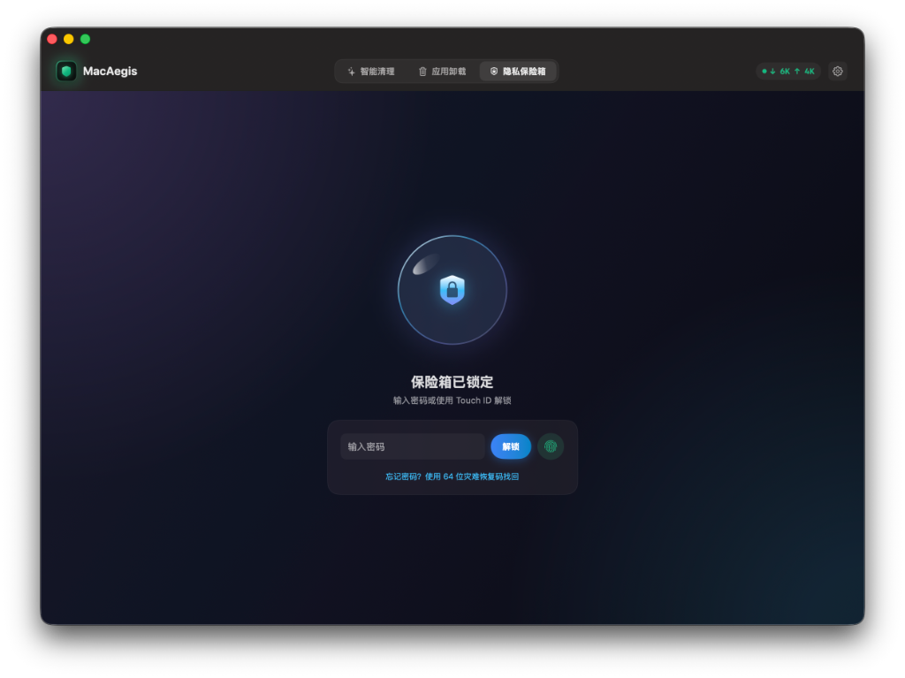
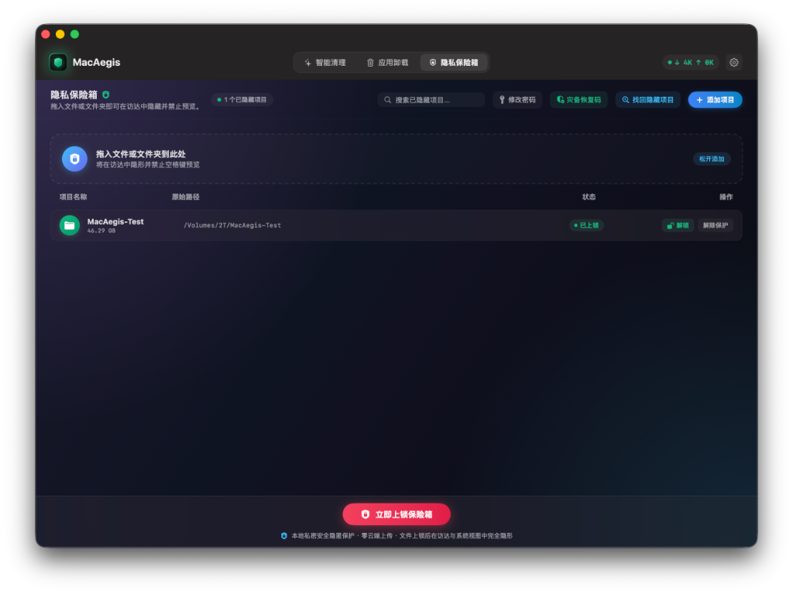
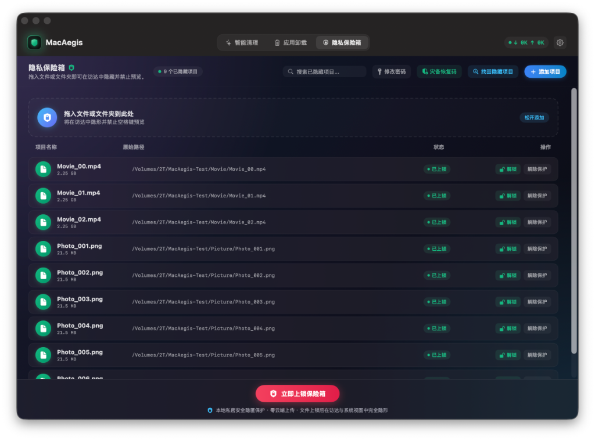
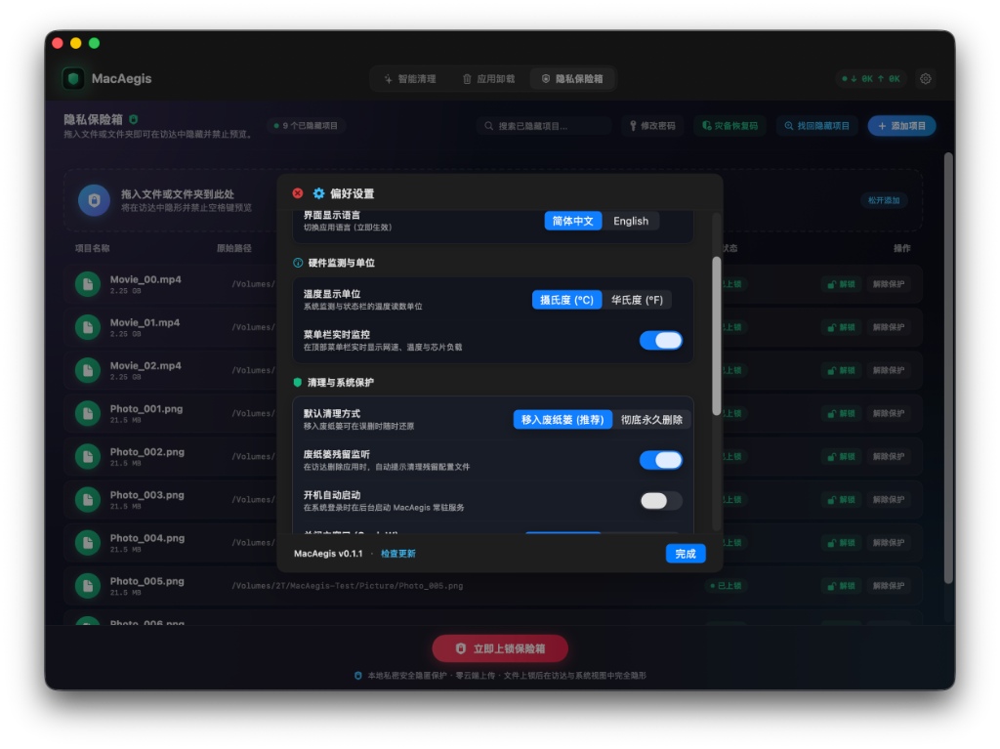

# MacAegis

<p align="center">
  
</p>

<p align="center">
  
  
  
  
</p>

---

## 功能展示

### 1. 隐私保险箱
<p align="center">
  
</p>

<p align="center">
  
</p>

### 2. 智能清理
<p align="center">
  
</p>

### 3. 应用卸载
<p align="center">
  
</p>

### 4. 偏好设置与系统监控
<p align="center">
  
</p>

<p align="center">
  
</p>

---

## 核心特性

* **隐私保险箱** — 一键隐藏文件和文件夹，Touch ID / 密码双重解锁，支持恢复码。
* **系统监控** — 实时显示 CPU、内存、网速，常驻菜单栏随时可见。
* **历史清理** — 管理系统使用记录，减少隐私痕迹。

---

## MacAegis · 设计思路

在 Mac 上隐藏文件，原生方式要敲命令行，繁琐且不优雅。

MacAegis 做的事很简单：**给文件盖一个盖子**。

* **不移动文件、不读写内容、不加密**——只改一个文件系统标记，让它从 Finder 和 Spotlight 里彻底消失。
* 不管文件夹还是文件，路径选择抑或者直接拖动到保险箱，隐藏和释放都是**瞬时完成**。
* **不做加密是刻意的选择**。加密一旦出错，用户数据可能灾难性损失；而视觉隐藏已经解决了 90% 的日常隐私需求——防的是随手翻 Finder 的人，不是破解你硬盘的人。
* **完全离线运行**，不上云、不联网、不收集任何数据，你的文件从始至终只在你自己的设备上。

---

## 系统要求与安装

* 纯 Swift 原生开发，体积绝对轻量，内存占用对老旧机型绝对友好。
* 支持 macOS 14.0 (Sonoma) 及以上系统，优先针对 Apple Silicon（M 系列芯片）开发，未针对 Intel 机型做充分测试。
* 前往 [Releases](../../releases) 页面下载最新版本，解压后拖入“应用程序”文件夹。

> **提示**：未做苹果开发者付费公证，初次打开若提示“已损坏”或“无法验证开发者”，在终端执行一行命令解除隔离即可：
> ```bash
> xattr -cr /Applications/MacAegis.app
> ```
> （或者右键点击 App 选择「打开」并在「系统设置 -> 隐私与安全性」中点击「仍要打开」）

---

发现问题或有建议欢迎提 Issue 交流。

