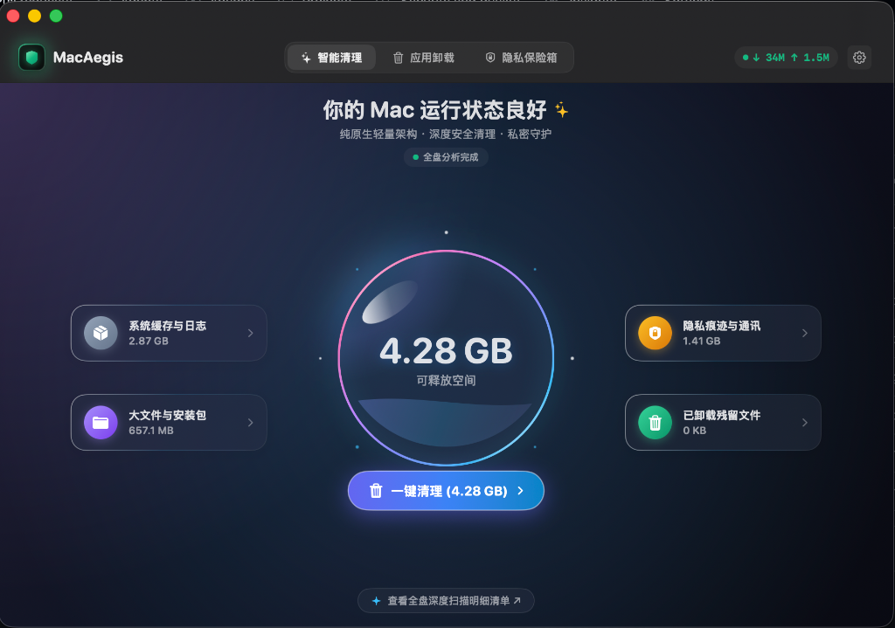
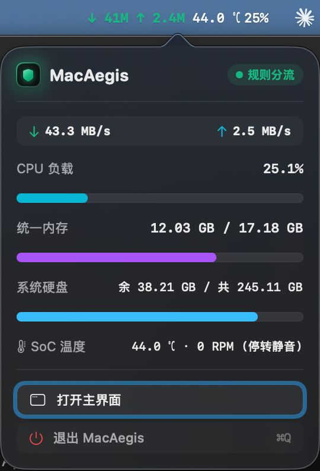
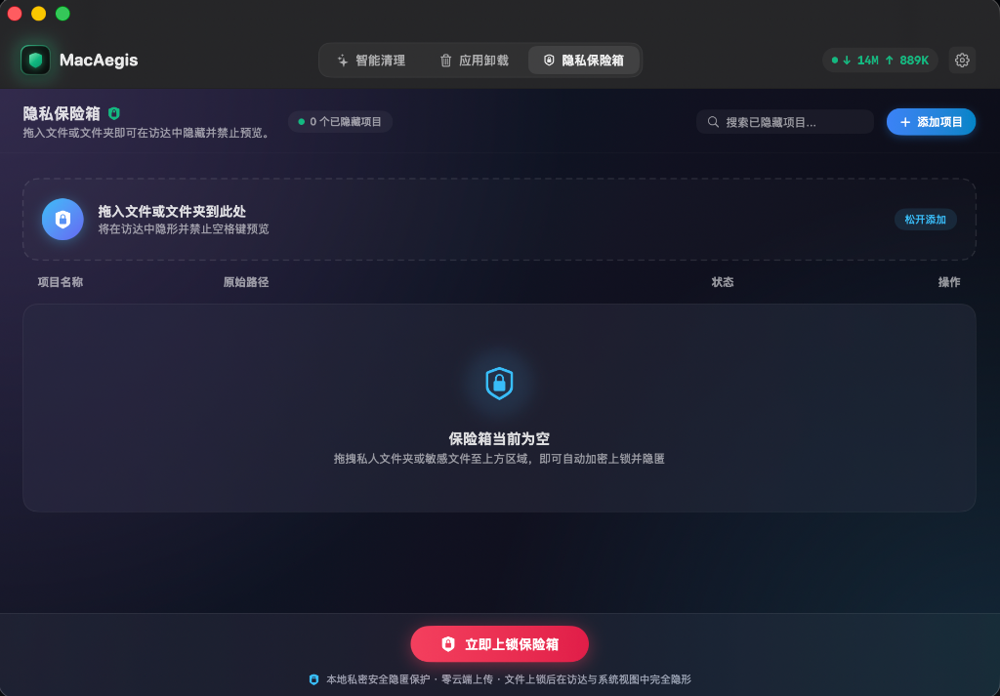
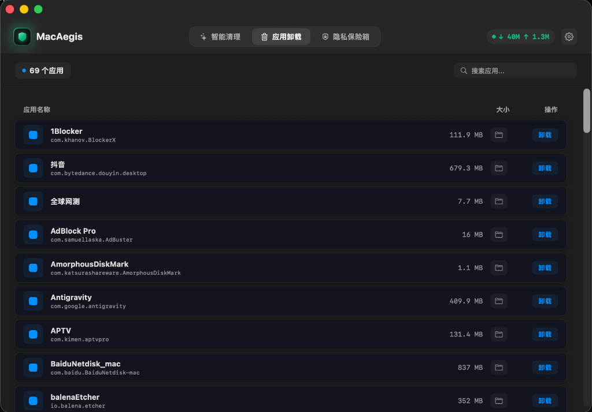

# MacAegis

<p align="left">
  <a href="README.md">简体中文</a> | <b>English</b>
</p>

Mainly solves two things: checking network proxy routing status at a glance in the menu bar, and quickly hiding private files, with a lightweight developer cache cleaner and uninstaller built in.

<p align="center">
  
</p>

---

## What it does

### 1. Menu Bar Proxy Routing Status
When using proxy utilities, it's often unclear whether your traffic is currently direct or routed through a proxy. MacAegis displays real-time upload/download speeds in the menu bar:
* Blue: Direct connection
* Green: Rule-based routing
* Red: Global proxy

Reads routing states directly from the macOS system layer, independent of which proxy client you use.

<p align="center">
  
</p>

### 2. Fast File & Folder Concealment
Avoid having sensitive desktop or Finder files peeked during screen sharing, external displays, or when lending your laptop:
* Drag and drop files or folders to hide them instantly—hidden from Finder and disabled from Spacebar QuickLook.
* Operates in-place: whether dozens of megabytes or 100GB+ folders, items are hidden instantaneously without copying files.
* Supports Touch ID + custom password to create local accounts, and Touch ID + password for quick unlocking and automatic Finder reveal.
* Credentials are saved in system Keychain: if the App is accidentally deleted, reinstalling it safely reclaims your existing files to prevent loss.

<p align="center">
  
</p>

### 3. Quick Cleaner & Uninstaller
* Easily clean Xcode build caches (DerivedData), developer temporary files, system logs, and browser caches.
* Drag and drop any App to find and remove scattered config leftovers across Library folders.

<p align="center">
  
</p>

---

## Requirements & Installation

* Built purely in native Swift, extremely lightweight, and friendly to older machines.
* Requires macOS 14.0 (Sonoma) or later. Primarily built for Apple Silicon (M-series chips); not tested on Intel models.
* Download the latest build from Releases and move it to your Applications folder.

> **Note**: As an unsigned indie binary, if macOS shows a "damaged" or "unidentified developer" prompt on first launch, run this single line in Terminal to clear the quarantine attribute:
> ```bash
> xattr -cr /Applications/MacAegis.app
> ```
> (Or right-click the App -> select "Open" -> click "Open Anyway" in System Settings -> Privacy & Security)

---

If you run into issues or have ideas, feel free to open an issue.
