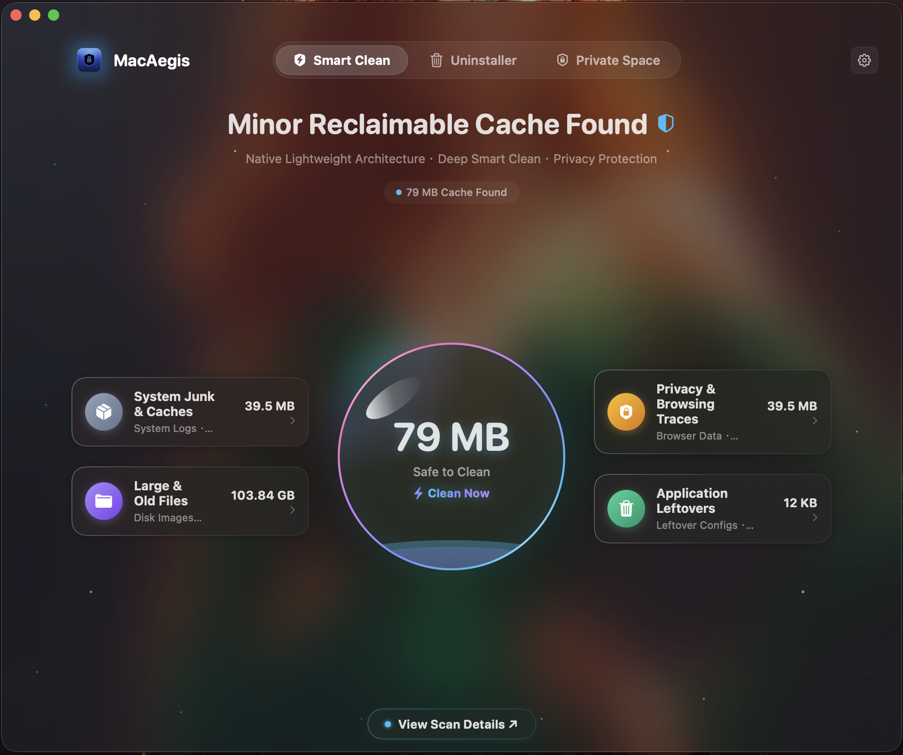
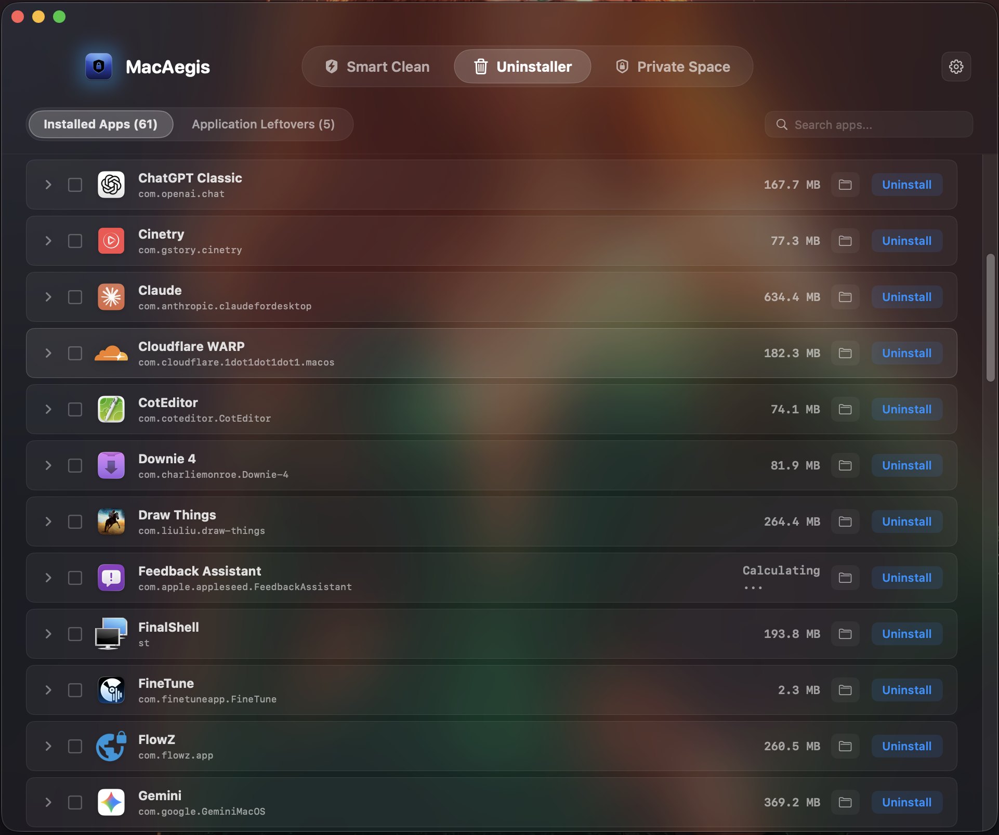
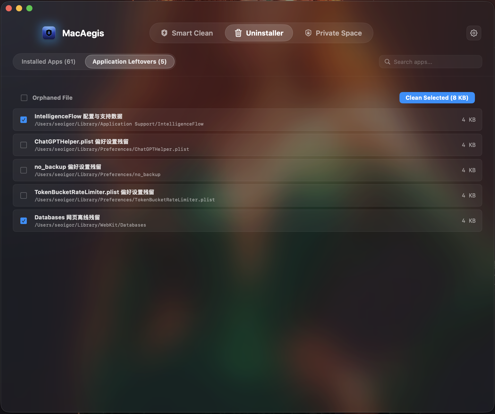
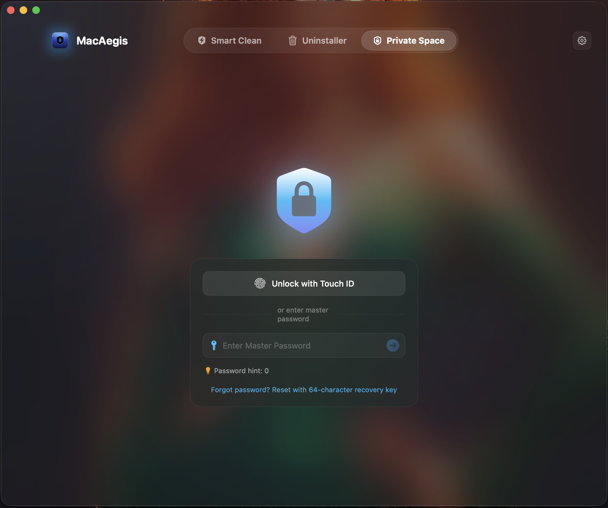
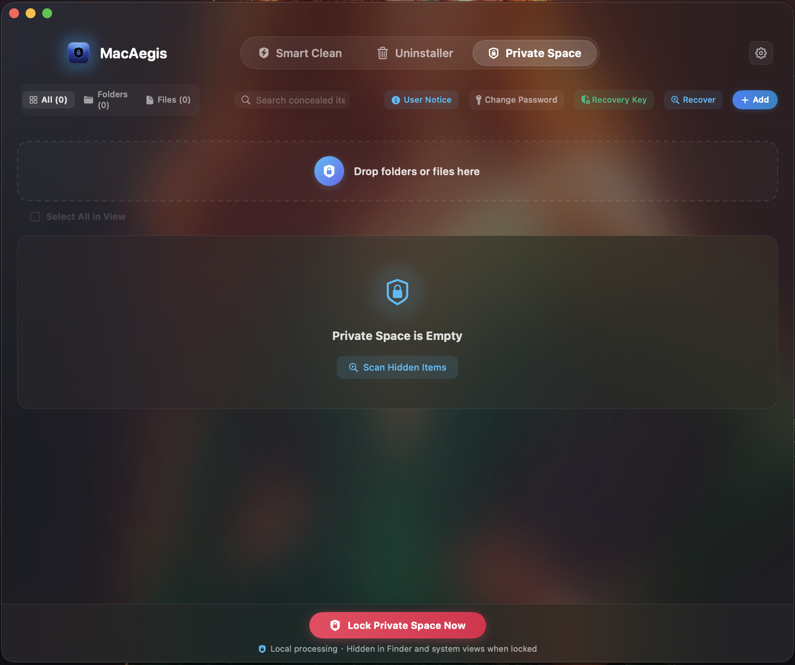
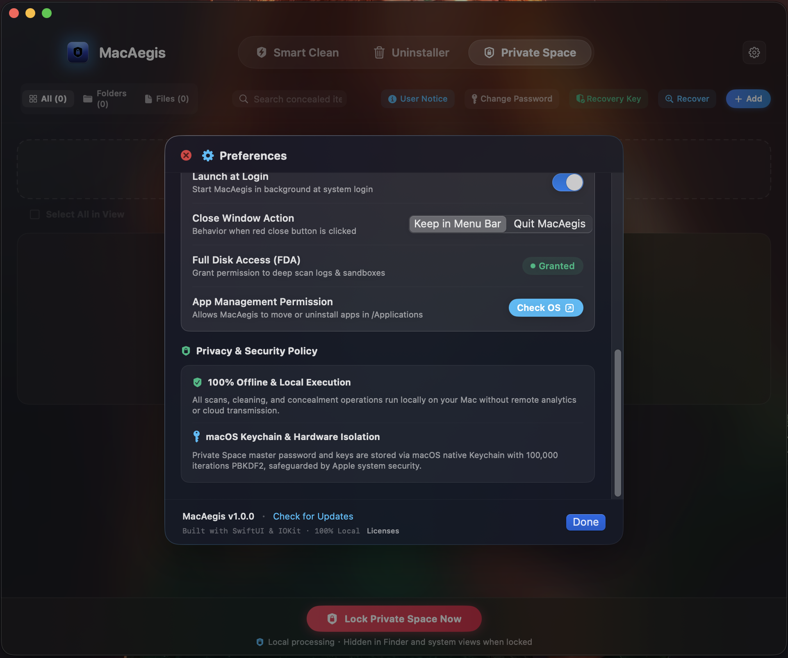
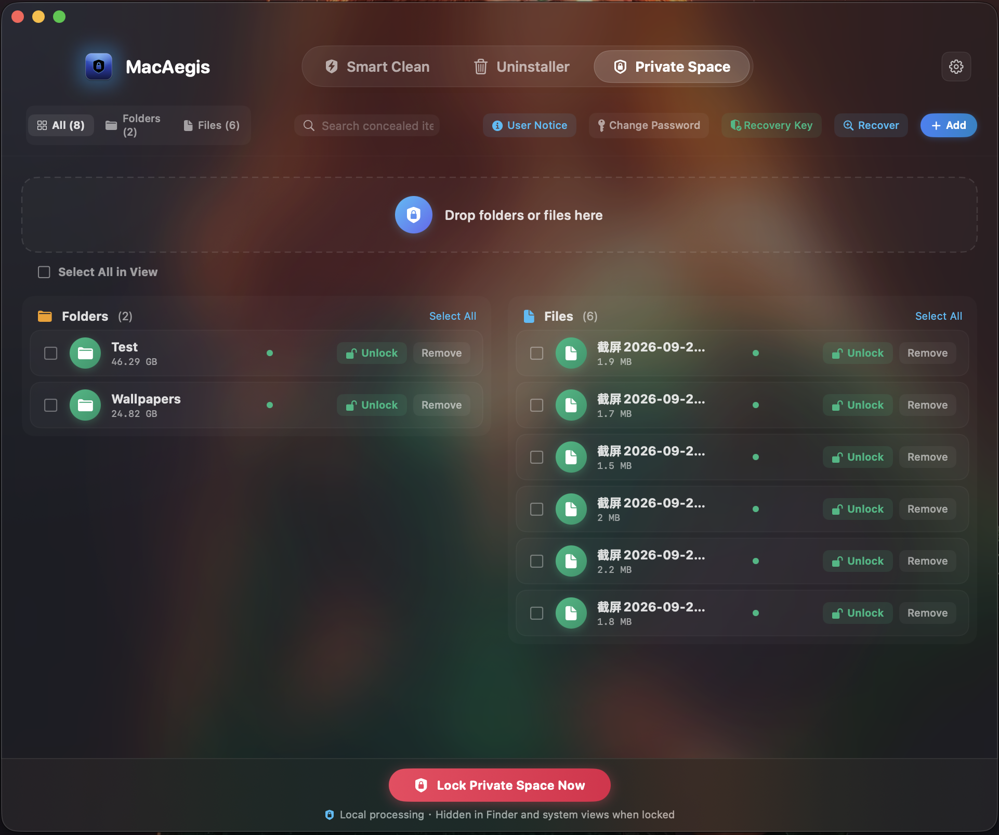
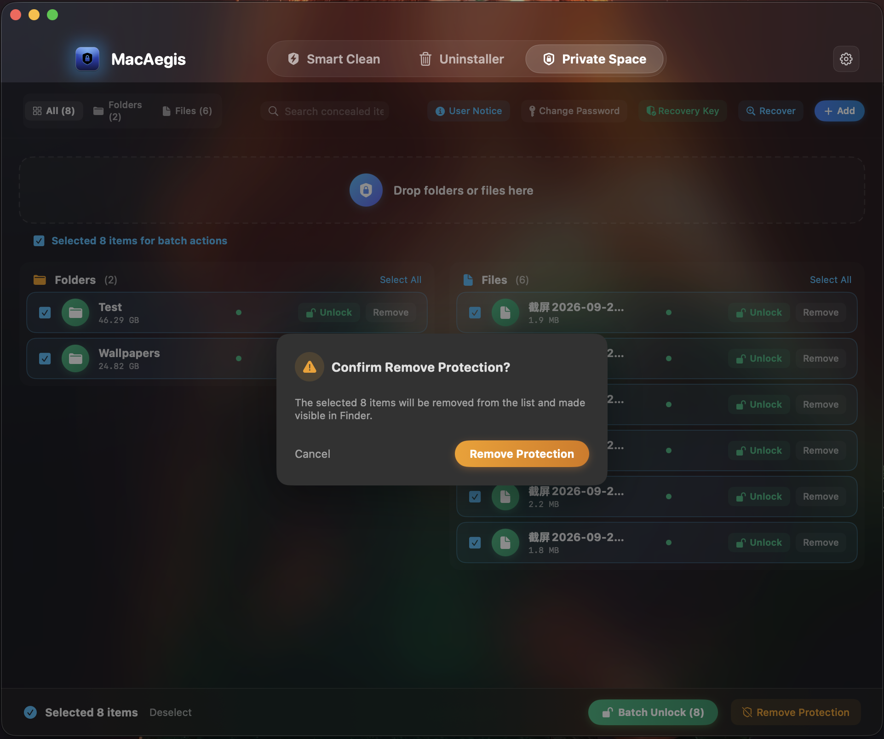
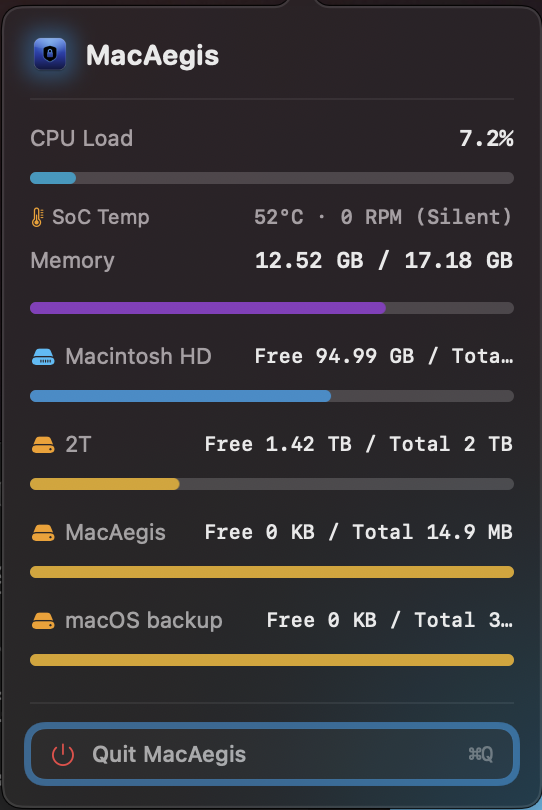

# 🛡️ MacAegis

<p align="center">
  
</p>

<p align="center">
  <strong>A Pure Swift Native macOS Utility for Instant File Stealth and Lightweight System Maintenance</strong>
</p>

<p align="center">
  
  
  
  
  
</p>

<p align="center">
  <a href="#-feature-showcase">Feature Showcase</a> •
  <a href="#-installation--usage-guide">Installation Guide</a> •
  <a href="#-download">Download</a> •
  <a href="README.md">中文版本 (Chinese)</a>
</p>

---

## 📖 Introduction

**MacAegis** is a modern macOS desktop utility crafted for **instant folder & file concealment, deep application leftover inspection, and lightweight system maintenance**.

When working on a Mac, personal privacy and sensitive work archives often require discreet protection, while the system continually accumulates development caches and uninstalled app leftovers. MacAegis delivers an elegant, pure, and native solution:

* **Embracing Native Liquid Glass Design**: Tailored around macOS modern visual materials, featuring a unified seamless titlebar, refined frosted translucency, and fluid physics-based interactions that integrate naturally into your Mac desktop.
* **Pure Swift 6 Native Architecture**: Built entirely in pure Swift 6 and optimized for both Apple Silicon (M-series) and Intel architectures. The distribution image is only **~1.7 MB**—free from heavy cross-platform frameworks, launching instantly with near-zero idle background resource footprint.
* **Instant Stealth with No File Size Limits**: Featuring an intuitive "Private Space" workflow. Whether small documents or massive multi-gigabyte project folders and media libraries (10 GB to 100 GB+), dragging items in conceals them in-place instantly, vanishing them from Finder and system searches. No duplicate copies are created, and zero extra disk space is consumed.
* **Touch ID Biometrics & Emergency Recovery**: Supports fast biometric verification via native Touch ID or master password unlock, backed by an independent 64-character disaster recovery key for total peace of mind.
* **Deep Uninstaller & Orphan Residual Analysis**: Traverses system directories to catalog installed applications with physical disk footprints, automatically detecting orphaned configuration files and caches left behind by removed applications.
* **Menubar Telemetry**: Lives unobtrusively in your status bar with minimal power draw, providing real-time telemetry on SoC core temperature, fan speed, unified memory pressure, and connected storage volumes.
* **100% Localized & Zero File Content Reading/Writing**: Operates entirely offline on your Mac with zero networking modules and zero telemetry—absolutely no user data is ever uploaded. File concealment takes effect completely in-place, **never reading, copying, transferring, or modifying the actual contents of your personal files**. Quitting the application immediately releases all allocated memory.

---

## 📸 Feature Showcase

### 1. Smart Clean Dashboard
Provides an intuitive overview of storage health, offering one-click smart scanning for temporary caches, logs, and reclaimable junk, complete with large-file inspection.
<p align="center">
  
</p>

### 2. Installed Applications
Clearly catalogs all installed applications on your Mac, displaying accurate physical disk footprints and bundle versions for quick search and Finder navigation.
<p align="center">
  
</p>

### 3. Application Leftovers & Residual Cleanup
Automatically tracks down orphaned configuration files, application support remnants, and sandbox caches left behind by uninstalled software to reclaim valuable space.
<p align="center">
  
</p>

### 4. Private Space Verification & Unlock Screen
A minimalist, modern security gateway supporting native Apple Touch ID biometric authentication and master password access, with built-in recovery key reset support.
<p align="center">
  
</p>

### 5. Private Space Ingestion & Ready State
A clean ingestion canvas allowing you to drag and drop sensitive folders or files for instant in-place concealment, complete with a quick scan for existing hidden items.
<p align="center">
  
</p>

### 6. Preferences & Permission Controls
Provides system-level preference toggles including launch at login and close-window behavior, along with clear status indicators for Full Disk Access (FDA) and App Management.
<p align="center">
  
</p>

### 7. Concealed Assets Management
A structured repository displaying protected folders and files, item sizes (supporting massive 10GB–100GB+ directories), lock status capsules, and quick Finder reveals.
<p align="center">
  
</p>

### 8. Batch Operations & Multi-Select
A flexible multi-select action bar enabling you to unlock, lock, or release protection across multiple concealed assets simultaneously for effortless file management.
<p align="center">
  
</p>

### 9. Menubar Telemetry Card
An ultra-lightweight status bar popup providing real-time hardware telemetry: SoC core temperature, fan speed, unified memory pressure, and mounted disk volume capacity.
<p align="center">
  
</p>

---

## 🚀 Installation & Usage Guide

### 1. Standard Installation

#### Option A: Install via Homebrew Cask (Recommended)
```bash
brew install meowvia/tap/macaegis
```

#### Option B: Manual DMG Download
1. Download the latest `MacAegis-vX.Y.Z.dmg` installer package from the [Releases Page](https://github.com/meowvia/MacAegis/releases);
2. **First-time Install**: Open the DMG image and drag **MacAegis** onto the "➡️ Drag to Install" shortcut;
3. **Upgrading (Recommended)**: Double-click `Update Assistant (更新助手).command` inside the DMG. The assistant will safely terminate older instances, update the application in place, and exit gracefully;
4. Launch MacAegis from Launchpad or Applications.

---

### 2. First-Time Launch & Security Notice

MacAegis is an independent freeware utility utilizing local Ad-Hoc code signing. If macOS Gatekeeper displays an "Unverified Developer" notice on initial launch:

**Quick Resolution:**
* In Finder's **Applications** folder, locate **MacAegis**, hold the **Control key** and click the icon, then select **"Open"** from the context menu and confirm;
* Or run this single command in **Terminal** to clear the quarantine attribute:
```bash
sudo xattr -rd com.apple.quarantine /Applications/MacAegis.app
```

---

### 3. Full Disk Access (FDA) Permission Notice

To allow deep inspection of system caches and app preferences, grant **Full Disk Access (FDA)** when prompted:
1. Open macOS **System Settings** → **Privacy & Security** → **Full Disk Access**;
2. Locate **MacAegis** in the list and toggle it on.
3. **⚠️ Important Notice for Upgrades**: Under macOS security architecture, permissions are strictly bound to the unique code signature of each build. When overwriting or updating MacAegis, if scanning results appear empty, simply remove the old MacAegis entry [-] in Full Disk Access, and click [+] to re-add `/Applications/MacAegis.app`. Running the included Update Assistant can also guide you directly to this pane.

---

## 📦 Download

* **GitHub Official Releases**: [MacAegis Releases](https://github.com/meowvia/MacAegis/releases)
* **System Requirements**: macOS 14.0 (Sonoma) or newer, natively compatible with Apple Silicon (M1/M2/M3/M4 series) and Intel Macs.

<p align="center">
  <br />
  <a href="https://wise.com/pay/me/nongjins">
    
  </a>
  <br />
  <sub>☕️ <strong>Buy the Indie Developer a Coffee (Support on Wise)</strong></sub><br />
  <sub>Testing Wise cross-border channel workflows; any genuine support for continuous development is deeply appreciated ❤️</sub>
</p>

---

## 📄 Privacy & Licensing Notice

MacAegis is free software. All operations execute 100% locally on your Mac. It contains zero networking capabilities, never uploads any data, and **never reads or modifies the contents of your personal files**. Pure, transparent, and respectful of your privacy. Feedback and suggestions are warmly welcomed!

